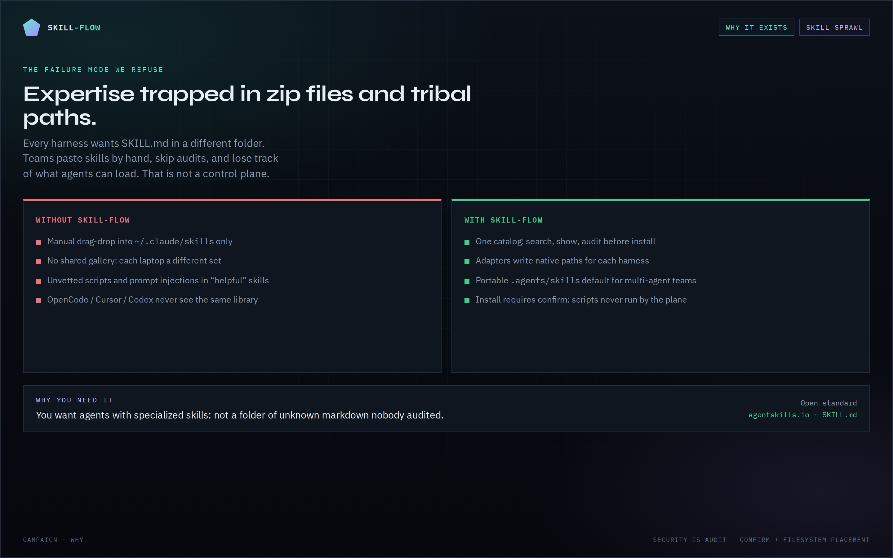
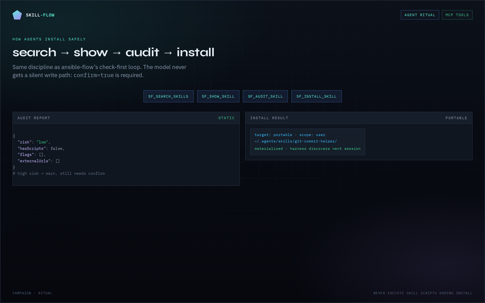
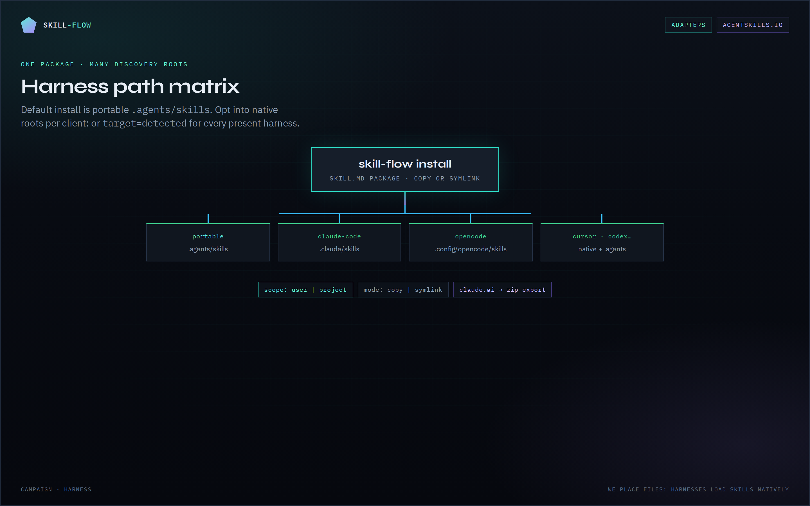
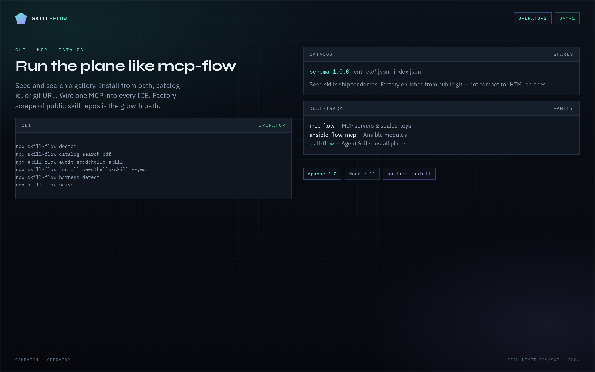

# skill-flow

**One plane to catalog, audit, and install Agent Skills into every harness.**

This branch (`CORE`) is documentation only. The runnable catalog and install plane live on [`DEVELOPMENT`](https://github.com/real-limitless/skill-flow/tree/DEVELOPMENT). `main` stays a product alias.

| | |
|---|---|
| **License** | [Apache-2.0](LICENSE) |
| **Install / code** | [`DEVELOPMENT`](https://github.com/real-limitless/skill-flow/tree/DEVELOPMENT) |
| **Marketing site** | [site/](site/) |
| **Branches** | [BRANCHES.md](BRANCHES.md) |
| **Species** | [SPECIES.md](SPECIES.md) |
| **Voice** | [VOICE.md](VOICE.md) |

## Visual tour

| | |
| :---: | :---: |
| **Why it exists** | **Agent ritual** |
|  |  |
| **Harness adapters** | **Operators** |
|  |  |

Re-shoot: `npm run campaign:capture` (from `docs/campaign/capture.sh`).

---

## Why

Skills package expertise as folders. Every harness discovers them from slightly different paths. skill-flow is the control plane:

```text
search → show → audit → install(confirm) → list_installed
```

Harnesses only see normal filesystem skills after install: no proprietary runtime lock-in.


---

## Quickstart

Requirements: **Node.js ≥ 22**, `git` on PATH (for remote installs).

```bash
npm install
npm run build
npm run catalog:seed

npx skill-flow doctor
npx skill-flow catalog search commit
npx skill-flow audit seed:hello-skill
npx skill-flow install seed:hello-skill --target portable --yes
npx skill-flow list
```

### MCP (stdio)

```bash
npx skill-flow serve
```

OpenCode / Cursor-style config:

```json
{
  "mcpServers": {
    "skill-flow": {
      "command": "npx",
      "args": ["skill-flow", "serve"]
    }
  }
}
```

Or point at a local build:

```json
{
  "mcpServers": {
    "skill-flow": {
      "command": "node",
      "args": ["/path/to/skill-flow/dist/cli.js", "serve"]
    }
  }
}
```

### Agent ritual (MCP tools)

| Tool | Purpose |
| --- | --- |
| `sf_search_skills` | Catalog search |
| `sf_show_skill` | Full gallery entry |
| `sf_audit_skill` | Static risk heuristics |
| `sf_install_skill` | Write skill tree (`confirm: true`) |
| `sf_list_installed` | Scan harness roots |
| `sf_list_harnesses` | Adapter matrix + detect |
| `sf_status` | Health |

---

## Install targets

| Target | Meaning |
| --- | --- |
| `portable` (default) | `~/.agents/skills/<name>` or project `.agents/skills` |
| `harness:opencode` | OpenCode native paths |
| `harness:claude-code` | Claude Code paths |
| `harness:cursor` | Cursor paths |
| `detected` | Every present dir-capable harness + portable |
| `generic` | `--path <parentDir>` |

Scope: `--scope user|project`.

```bash
npx skill-flow install ./my-skill --target harness:opencode --scope user --yes
npx skill-flow install https://github.com/org/repo --yes
npx skill-flow uninstall hello-skill --target portable
```

---

## CLI

```bash
skill-flow serve
skill-flow doctor
skill-flow harness list|detect
skill-flow catalog search|show|list|add|reindex
skill-flow install <source> --yes
skill-flow uninstall <name>
skill-flow list [--all]
skill-flow audit <source>
```

---

## Catalog

- Schema: `catalog/schema.json` (v1.0.0)
- Seeds: `npm run catalog:seed` → `catalog/seed/*` + `catalog/entries/*`
- Shards are gitignored; publish via factory / `catalog-data` branch (later)

Do **not** scrape competitor marketplaces as source of truth. Factory (planned) uses public git repos and seed lists only.

---

## Security

Skills are executable expertise (instructions + optional scripts). Treat install like software:

- `sf_audit_skill` before install
- Install requires explicit confirm (`--yes` / `confirm: true`)
- skill-flow never runs skill scripts during install
- High-risk patterns are flagged (curl|sh, secret paths, etc.)

---

## Marketing site

```bash
npm run catalog:seed
npm run site:build          # → site/out (default SITE_BASE=/skill-flow)
npm run site:preview        # http://127.0.0.1:4173
```

Live (after Pages enable): https://real-limitless.github.io/skill-flow/

---

## Status

**P1 install plane + seed catalog + campaign + static site implemented.** Factory scrape and HTTP gateway are next: see [PLAN.md](./PLAN.md).

---

## License

Apache-2.0


## Family

Written standard: private TheFLOW.

- mcp-flow: MCP servers and sealed keys
- ansible-flow-mcp: Ansible modules
- roster-flow: installs skills onto seats
- OpenFlow, wiki-flow, CleanFlow, ProjectEverflow: siblings
